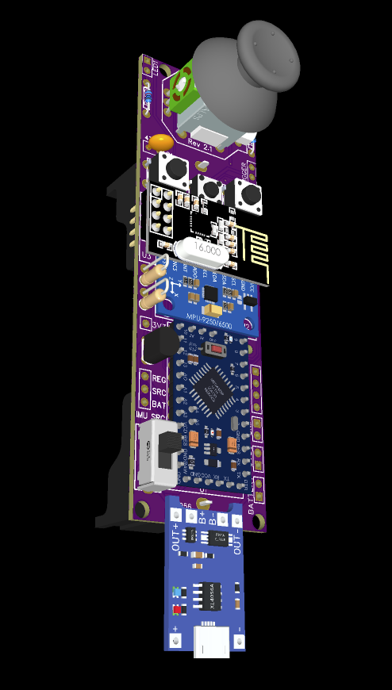
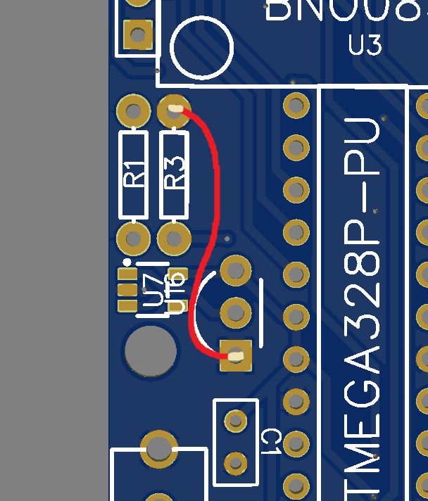
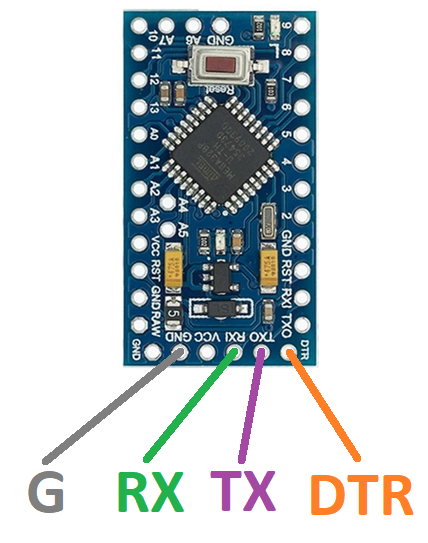
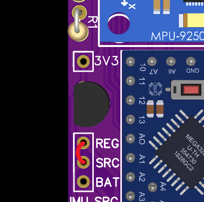
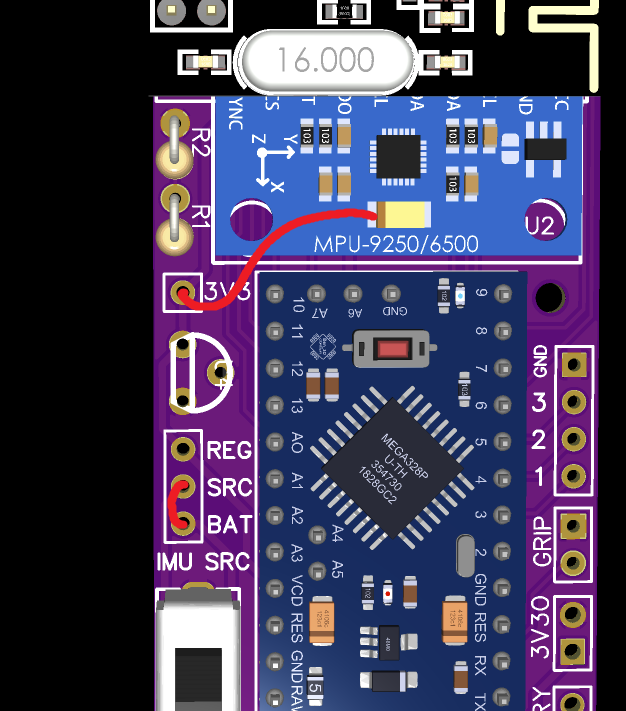

# HadesVR Wand Controllers

The HadesVR wand controllers are a DIY set of controllers that aim to emulate the functionality of the original Vive Wand controllers (and maybe more in the future).

They're made out of 3d printable shells (Not out yet) and a custom PCB board that comes with both controllers and a [HadesVR Basic HMD PCB](https://github.com/HadesVR/Basic-HMD-PCB) to get you started with DIY VR. These boards were designed to be easy to put together, using only through hole parts and commonly available modules.

The boards use an atmega328p as their core, an MPU9250 as the IMU and an NRF24L01 to transmit all data to the headset, there is planned support for some basic individual finger tracking but as of right now it is not supported. The controllers also have 3 spare GPIO pins that support PWM (pins mapped to PD3,PD5 and PD6) for tinkerers that want to add extra features like an RGB LED or even individual finger tracking.

# IMPORTANT NOTICE
If you've had these boards made before JAN/2022 and they weren't working properly or at all 
* check if they're running the latest firmware and you're running the latest driver version
* solder a jumper wire between the ground pin of the regulator and the R3/R7 resistor. there's a bit of an error on the board files prior to JAN/2022 in which your MCU/3.3v regulator might not be properly grounded. The jumper cable has to be wired like this:

## Hardware needed

Hardware needed for each controller is the following:

| Component | Purpose | Notes | Amount |PCB Marking|
| --------- | ----------- | ----- | ------ |------|
| Atmega328p DIP package | Brains of the controller | - | 1 |U1 or U5|
| MPU9250 Module*  | Used to gather rotation data | The IMU should sit flat against the pcb, this means you'll need to remove the black spacers on the pin headers after soldering them to the IMU. | 1 | U3 or U13|
| NRF24L01 Module | Used to communicate with the headset. | - | 1 | U4 or U12
| TP4056 Module with protection | In charge of battery management | you can get the USB-C version if you want to just make sure it has the built in battery protection circuit | 1 | No marking, bottom edge|
| HT7533 voltage regulator** | Used to regulate voltage for the IMU and RF receiver | HT7333 or MCP1700-3302E are also compatible. | 1 | U7 or U14 if reusing IMU regulator. Right next to it for Through hole.|
| PS4 Analog stick | Main joystick | Xbox One analog stick ***might*** also fit but I haven't tested it. | 1 | U2 or U11|
| 18650 battery holder | PCB mount preferred | The one with cables will also work but you'll have to solder to the battery points on the bottom right of the board | 1 | Back of the board |
| 18650 battery | The battery | Try to get original cells, the battery life of your controller depends on it, and if you get bad cells that lie about their capacity (ultrafire) you might need to change the charge current resistor on your TP4056. | 1 | - |
| 6x6 tact switch| Used to calibrate the magnetometer or switch between trackpad modes. | Also used for the trigger/grip buttons | 3 | Middle "DRIFT" button|
| 7x7 rubber dome switch| Menu and System button switches. | [These](Files/KLS7-TS7703.pdf) are the ones I used, you can find them in bulk on aliexpress for cheap | 2 | Menu and Sys buttons. |
| 5mm High brightness LED*** | Used for 6dof tracking | - | 1 |LED|
| LED Resistor*** | Used to limit the current for the LED, it's value depends on the color of the LED | 1/4w | 1 |RLED|
| 1kΩ Resistor | Used in the resistor divider for battery level monitoring | 1/4w | 1 |R1 or R8|
| 3.3kΩ Resistor | Used in the resistor divider for battery level monitoring | 1/4w | 1 |R3 or R7|
| 10kΩ Resistor | RESET line pullup | 1/4w | 1 |R2 or R9|
| 100nF capacitor | Used to smooth out the input and output regulator voltage. | - | 2 | C1 and C2 or C7 and C8 |
| 22pF capacitor | Used for the crystal oscillator. | - | 2 | C5 and C6 or C9 and C10|
| 12MHz crystal | Main crystal for the MCU | if you can't get a 12MHz one, a 16MHz one ***might*** work. | 1 | X1 or X2 |
| 1x5 male pin header | For ICSP | ***This one goes on the bottom of the board right next to the battery and you should solder it before the NRF24*** | 1 | ICSP |
| PCB Switch | To turn on and off the controller. | - | 1 | SW1 or SW2 |
| White ping pong ball | Used to difuse the LED's light for 6dof tracking | Any will do as long as it's white and 40mm in diameter | 1 |

*BNO085 is better but also more expensive and I haven't written any code for it.

#### **Regulator stuff:
You can reuse the one that comes with your MPU9250 in case you can't source any of the through hole regulator options.  However, for that you'll need to do some SMD soldering. **This is completly optional, if you can get the through hole regulators you won't need to do this at all and you can just leave the SMD footprint unpopulated. Do not solder both regulators at once, It's either one or the other.**

If you're comfortable with SMD soldering, you can desolder the 5 pin regulator from the IMU and solder it in the footprint marked U7 or U14. You'll also need to bridge the two pads in the IMU that are next to where the regulator (used to) sit:

After doing this you can simply leave the through hole regulator footprint unpopulated, the regulator that comes with the IMU is capable to deliver enough current to power the controller.

***The LEDs for each controller should be a different color, I recommend Blue for the right hand and Red for the left hand, the resistor value is calculated with a supply of 3.3v and an LED current of 18mA:
For the Red LED you'll need a 68Ω resistor
For the Blue LED you'll need a 12Ω resistor

Also needed is an arduino to use as a programmer with the ArduinoISP code on it.

#### You'll also need the 3d printable shell which isn't out yet.

## Assembly

Order of components isn't super important though you'll want to solder the 1x5 pin header on the bottom of the board *before* you solder the NRF24L01 RF module.

The IMU needs to lay as flat as possible against the pcb, to do this you'll need to remove the plastic pin spacers on the header under the IMU. It doesn't have to be perfect but if the IMU is at an angle your controllers won't be aligned with the IRL angle in VR.

You'll need to cut the pins under the board as short as possible or else you won't be able to solder the battery holder, since it goes on top of them. Again, it doesn't have to be perfect it just has to be enough for the battery holder pins to go through the pcb and be soldered on the other side. The battery holder is obviously soldered last since it goes under most components.

## Uploading the firmware

Before uploading the firmware you'll need something that lets you use the atmega328p with a 12MHz crystal, I recommend using [MiniCore][MiniCore], instructions on how to add it to your arduino IDE are right [here][installMiniCore].

You'll need an Arduino with the ArduinoISP code loaded onto it and have it connected to the controller like this:

After you've got everything connected the way it is in the picture and with the ArduinoISP code on the UNO, open the Arduino IDE and the code of the controller you want to upload (Right or Left), go to tools>board and select MiniCore>Atmega328.

then set the following settings:

| Setting | Value |
| ------ | ------ |
|Board|Atmega328|
|Clock|External 12Mhz|
|BOD|2.7V|
|EEPROM|EEPROM Retained|
|LTO|LTO Disabled|
|Variant|328P/328PA|
|Bootloader|No bootloader|

And click upload. Uploading through the Arduino as ISP is a bit slower than regular USB Serial so it might take around 30 seconds to upload and verify, if all goes well the LED of the controller should be flashing slowly which means you have to perform the magnetic calibration for the controller.

## Magnetic calibration

If you've just uploaded your code your controller will be slowly flashing, meaning you need to calibrate the controller before using it, to do that press and hold the middle button for a few seconds until the LED flashes quickly for around a second to let you know you're entering into calibration mode.

If you've already calibrated the magnetometer on your controller but want to do it again you need to turn off your controller, and turn it on while holding the calibration button. The LED will flash quickly a couple times to let you know you're entering into magnetic calibration mode.

Once you've entered into calibration mode the LED will stay solid for around 2 seconds and then turn off. once it turns off you'll need to wave the controller in a figure 8 pattern while slowly rotating it until the LED turns back on, this takes around 30 seconds.

Once the LED turns back on the calibration values will be saved into EEPROM and the LED will start flashing quickly, once it does you just have to turn the controller off and on again and if the LED stays solid then you've successfully calibrated the magnetometer on your controller.

## Accelerometer calibration

While not 100% necessary, it's recommended you calibrate the accelerometer of your controller. To do this, turn on the controller while holding the calibration button alongside the system button (look at the diagram below to know which one it is). The LED will flash slowly 3 times to let you know you've entered Accelerometer calibration mode.

Once into the calibration mode, the LED will turn off and you'll have 5 seconds to put your controller on a flat surface (I recommend the floor). Once on the flat surface you'll just have to wait for a few seconds for the LED to turn back on to signify the calibration is done. If you didn't place the controller on a flat surface before the LED turned on you'll need to redo the calibration.

Once the LED turns back on the calibration values will be saved into EEPROM and the LED will start flashing quickly, once it does you just have to turn the controller off and on again.

## Controller bindings

The calibration button doubles as a joystick mode toggle switch:

Due to the design of the Vive Wands, you'd need to press down on the analog stick while holding it at an angle to do what you'd do by pressing down with your finger on the Vive wand trackpad. Because this is uncomfortable and sometimes even a bit hard to do, the controllers come with two analog stick modes:

The first (and default) one inverts the status of the pressing down of the analog stick, which means that, by default it registers as if you're pressing the trackpad down when you move the analog stick and it registers as if you're not pressing it down when you press it down.

The second one is the regular one which means you'll need to press down on the analog stick to simulate the pressing down of the trackpad, which can be uncomfortable and hard to do over long periods of time.

You can switch between both modes on the fly by pressing down the calibration button once.

   [MiniCore]: <https://github.com/MCUdude/MiniCore>
   [installMiniCore]: <https://github.com/MCUdude/MiniCore#how-to-install>