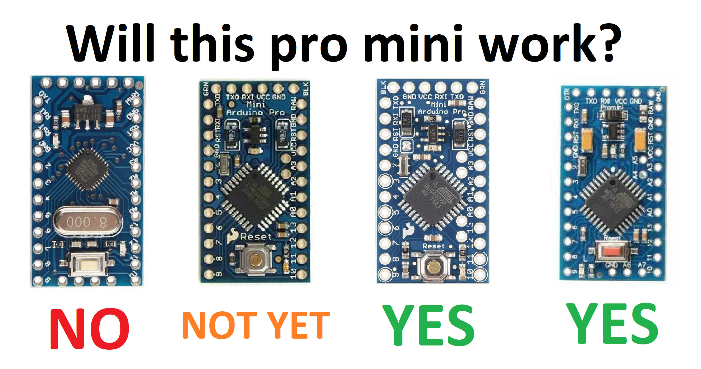
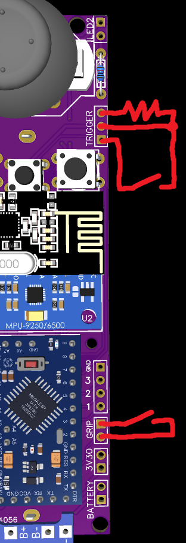
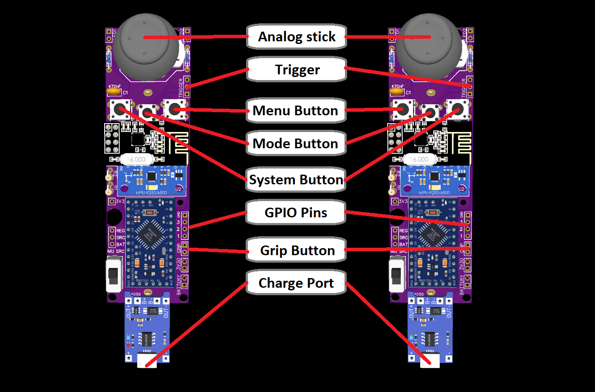

# HadesVR Wand Controllers

The HadesVR wand controllers are a DIY set of controllers that aim to emulate the functionality of the original Vive Wand controllers (and maybe more in the future).

They're made out of a custom PCB board that comes with two controllers to get you started with DIY VR. These boards were designed to be easy to put together, using only through hole parts and commonly available modules.
The gerbers for the boards are inside the Hardware/PCB folder, inside there there's three gerber files, 1x1 (not panelized), 2x1 (two controller boards on a single panel) and 3x1 (three controller boards on a single panel). Some PCB fabs can charge extra for panelized files so just in case you can simply submit the non panel version and avoid extra charges.
Even without the panelized boards you'll still get 5 controler boards per order (since that's usually their minimum order quantity) and get 10 or 15 if you go with the other options.

These controllers are meant to be combined with the [HadesVR Basic HMD PCB](https://github.com/HadesVR/Basic-HMD-PCB), since they're both easy to put together and make for an easy-ish way to get into DIY VR hardware.

These controllers are ***not bluetooth***, you absolutely need something to receive the RF data from these, either a [HadesVR Basic HMD PCB](https://github.com/HadesVR/Basic-HMD-PCB) or an RF receiver (take a look at the HadesVR docs for that one).

The boards use an Arduino pro mini 3.3v as their core, any IMU supported by the FastIMU library and an NRF24L01 to transmit all data to the headset, there is planned support for some basic individual finger tracking but as of right now it is not supported. The controllers also have 3 spare GPIO pins for tinkerers that want to add extra features like an RGB LED or even individual finger tracking.

## Hardware needed

Hardware needed for each controller is the following:

| Component | Purpose | Notes | Amount per controller |PCB Marking|
| --------- | ----------- | ----- | ------ |------|
| Arduino pro mini 3.3v/8mhz | Brains of the controller |  ***⚠️ NEEDS TO BE THE 3.3V VERSION, CHECK NOTES BELOW!!!!!!!*** | 1 |U1|
| IMU  | Used to gather rotation data | Any IMU supported by the FastIMU library. Make sure to line the 3.3v, GND, SDA and SCL pins with the ones of your IMU if it's not the standard shape. The IMU should sit flat against the pcb, this means you'll need to remove the black spacers on the pin headers after soldering them to the IMU. | 1 | U2|
| NRF24L01 Module | Used to communicate with the headset. | You might have to isolate the crystal pins from the IMU with electrical tape. | 1 | U3
| TP4056 Module with protection | In charge of battery management | USB-C version recommended. Make sure it has the built in battery protection circuit | 1 | TP4056 bottom edge|
| HT7533 voltage regulator* | Used to regulate voltage for the IMU and RF receiver | HT7333 or MCP1700-3302E are also compatible. | 1 | No marking, right below 3v3 pad.|
| PS4 Analog stick | Main Analog stick | Xbox One analog stick ***might*** also fit but I haven't tested it. | 1 | U6 |
| 18650 battery holder | PCB mount preferred | The one with cables will also work but you'll have to solder to the battery points on the bottom right of the board | 1 | Back of the board |
| 18650 battery | The battery | Try to get original cells, the battery life of your controller depends on it, and if you get bad cells that lie about their capacity (ultrafire) you might need to change the charge current resistor on your TP4056. | 1 | - |
| 6x6 tact switch| Used to calibrate the magnetometer or switch between trackpad modes. | Also used for the trigger/grip buttons | 3 | Middle "MODE" button|
| 7x7 rubber dome switch| Menu and System button switches. | [These](Hardware/PCB/KLS7-TS7703.pdf) are the ones I used, you can find them in bulk on aliexpress for cheap | 2 | Menu and Sys buttons. |
| 5mm High brightness LED** | Used for 6dof tracking | - | 2 |LED1 and LED2|
| LED Resistor** | Used to limit the current for the LED, it's value depends on the color of the LED | 1/4w | 1 |RLED1 and RLED2|
| 1kΩ Resistor | Used in the resistor divider for battery level monitoring and as a pull up for the trigger | 1/4w | 2 |R1|
| 3.3kΩ Resistor | Used in the resistor divider for battery level monitoring | 1/4w | 1 |R2|
| 470nF capacitor | Used to smooth out the output regulator voltage. | - | 1 | C1 |
| PCB Switch | To turn on and off the controller. | - | 1 | SW1 or SW2 |
| Male PCB pins | To solder to the arduino, IMU and TP4056 | - | - | - |
| White ping pong ball | Used to difuse the LED's light for 6dof tracking | Any will do as long as it's white and 40mm in diameter | 1 |

#### Arduino pro mini
The center piece of this controller is the Arduino pro mini 3.3v, 8mhz. This controller will most likely not work if you put in a 5v version of the arduino as running the crystal at 16mhz at 3.3v (and less) is *fairly out of spec*.
Moreover, for some ***stupid*** reason there's a few different hardware variants of the arduino pro mini that move some of the analog pins around or straight up don't have them (yay, fun)
Before buying the Arduino it's important you consult the table below to know if the arduino is compatible, since the A6 and A7 pins are used for the trigger and one of the analog stick axis.

A revision 2.2 will be made eventually that will add partial support for the second type of Arduino, however it will not have battery level monitoring.

#### *Regulator stuff:
You can reuse the one that comes with your IMU ***only if it's one of the blue MPUXXXX ones with the tantalum capacitor***.
You should only do this as a last option in case you can't get the 3.3v reg or it's alternative. To do this you'll need to do some SMD soldering. More info down in the Assembly part of this document.

#### **LED's: 
The LEDs for each controller have to be different colors, I recommend Blue for the right hand and Red for the left hand, the resistor value is calculated with a supply of 3.3v and an LED current of 18mA:
For the Red LED you'll need a 68Ω resistor for each RLED
For the Blue LED you'll need a 12Ω resistor for each RLED

#### Also needed:
A USB to Serial adapter and some breadboard cables to upload code to the controllers. Here's a list of the ones I've tried in order from best to e-waste:
* FTDI ones are probably the best, they behave very well, usually come with selectable voltage levels. 
* CP2102 ones also work well, though some come without selectable voltage levels 
* Arduino UNO (only the version with the removable chip): Works great though a bit fiddly
* CH340's are *fine* though do need a driver.
* PL2303 ones are terrible, don't get them, their drivers have been deprecated, they very often fail to connect and upload and *a lot* of them don't come with a reset line. 

#### You'll also need the 3d printable shell which isn't out yet.

## Assembly
⚠️ Before starting you should test your IMU using the FastIMU library examples.

⚠️ Don't solder pins to the Arduino pro mini's programming header, only solder in the necessary pins that go on the board. if you put right angle pins on the programming header you'll have a bad time soldering in the battery connector, and if you put in straight pins they'll stick up too far.

Solder in your IMU first, ***Check that the pins match, make sure the IMU's SDA goes to SDA, SCL goes to SCL, GND goes to GND and 3V3 or VCC go to VCC.*** This is important, some IMU's have a VCC pin AND a 3.3V pin, in those cases you need to match the 3.3v pin to VCC <u>AND CANNOT USE THE IMU'S REGULATOR TO POWER THE CONTROLLER</u>

Solder in the NRF24 second, make sure the pins on the crystal of the NRF24 aren't making contact with the IMU pads. if they do you might need to cut them flush or add some electrical tape between IMU and RF module.

The IMU needs to lay as flat as possible against the pcb, to do this you'll need to remove the plastic pin spacers on the header under the IMU. It doesn't have to be perfect but if the IMU is at an angle your controllers won't be properly aligned with the IRL angle in VR.

#### Regulator:
If you have a regulator it's time to solder it in. After doing so, you'll need to bridge SRC and REG pins right below it, I recommend using a resistor leg bent in a U shape to accomplish this, like seen in the picture:

In case you don't have a 3.3V regulator and are using the one in the IMU, you'll need to find the positive side of the tantalum cap on the IMU and solder a cable from it to the 3.3V pin, then you'll have to bridge the SRC and BAT pins together with an U shaped resistor leg. This allows the IMU to get full battery voltage and us to use it's regulator to power the rest of the controller:

Solder in the rest of the top side components next, going from smallest to largest, let the TP4056 be the last one. you'll need to solder pins to it and do the same treatment to it as the IMU: Remove the black spacers and solder it flat against the board.

You'll need to cut the pins under the board as short as possible or else you won't be able to solder the battery holder, since it goes on top of them. Again, it doesn't have to be perfect it just has to be enough for the battery holder pins to go through the pcb and be soldered on the other side. The battery holder is obviously soldered last since it goes under most components.

#### Trigger and Grip buttons
At the moment, the trigger needs an external pull up resistor, you can use 1k or 3.3k if you have leftovers from the battery sensing circuit. Note that this only applies to Revision 2.1 of the board as in later revisions this will not be necessary.

The trigger and grip buttons should bridge the sense pin to ground whenever pressed, therefore the connection should look something like this:

## Uploading the firmware

Uploading the firmware varies a little on which programmer you're using, you'll need four cables and the programmer.
The cables being male-male or female-male depends on your programmer so if you have a programmer with pins you'll need male-female, if not you'll need male-male.

Pop in the battery, make sure it's charged (you can charge the controller with the USB port on the TP4056) and flip on the switch, the power LED on the Arduino pro mini should light up. We are not going to be supplying power for programming, since some programmers supply 3.3v while others supply 5v, so as a catch all we're gonna go the safer route of not providing power through the programmer.

Turn off the controller and put the male end of the breadboard cables through the following programming header's pins:

*The pins are labeled, check that your label matches with the pins shown*
* Connect GND to GND of the programmer
* Connect DTR to DTR of the programmer
* Connect TX to RX of the programmer
* Connect RX to TX of the programmer
* Open the Arduino IDE, open Firmware.ino, install the required libraries through the library manager: FastIMU and RF24.
* Leave the controller role of choice uncommented and set your IMU address and IMU type.
* Set the board to "Arduino pro or pro mini" And set the processor to "Atmega328p (3.3v, 8mhz)"
* Turn on the controller and connect the programmer
* Select the correct COM port and click upload

if all goes well the LED of the controller should be flashing which means you have to perform calibration.

## Calibration

Before using the IMU's accelerometer and gyroscope need to be calibrated, to do this, power off the controller and hold the MODE and MENU button down, then turn on the controller, the LEDs should flash twice and then turn off. 
Once they turn off you need to place the controller facing up on a flat and level surface and leave it there until the LEDs turn back on.

If your IMU of choice also has a magnetometer you have to calibrate it too, to do that simply power off the controller and power it back on, this time only holding down the MODE button as you do. The LEDs should flash three times and then turn off, once it turns off you need to move the controller in a figure eight motion in the air while turning it around until it's done calibrating, this takes around 30 seconds.
Once the magnetometer calibration is done the LEDs will flash twice to let you know and then all calibration values will be saved to the onboard memory.

if you ever need to redo calibration simply repeat the steps shown here.

## Controller bindings

The button used for calibration doubles as a joystick mode toggle switch:

Due to the design of the Vive Wands, you'd need to press down on the analog stick while holding it at an angle to do what you'd do by pressing down with your finger on the Vive wand trackpad. Because this is uncomfortable and sometimes even a bit hard to do, the controllers come with two analog stick modes:

The first (and default) one inverts the status of the pressing down of the analog stick, which means that, by default it registers as if you're pressing the trackpad down when you move the analog stick and it registers as if you're not pressing it down when you press it down.

The second one is the regular one which means you'll need to press down on the analog stick to simulate the pressing down of the trackpad, which can be uncomfortable and hard to do over long periods of time.

You can switch between both modes on the fly by pressing down the mode button once.

